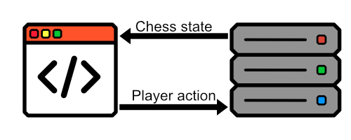

# chess

## Introduction

This is a remake of the chess program I made this summer. It will probably contain a lot of the same code and structure, but with a few key differences that will make this faster to develop, and a full-stack project. I will therefore develop the back-end using a javascript framework using node or deno. The back-end will utilize WebSocket, and all the chess logic. The front-end wil therefore only be used to display the board state. I think that most of the front-end work is aready done, while the logic of the back-end will need a few updates to make a better developer experience. I am making this new repo because 1) the project seemed big enough to get it's own repo, 2) because it suffered from technical debt, and I did not want to massacre my boy in his own repo and 3) because I wanted to implement WebSockets, which would entail a lot of rewriting anyways. Further updates in this README-file will be done in a blog-like fashion, so that I can share my thoughts throughout the development process.

## What this will do better than my previous project, 20.10;

Here are some things that annoyed me during my previous implementation of chess

### #1 Special moves was tedious

Coding moves such as en Passant, Castling and promotions worked, but they were quite tedious to implement. I want a system where implementing such special moves are better from a developer perspective, and such easier to do more robust. I therefore want a system where pieces can more easily "see" other pieces relative to itself, and be able to move two pieces in one move (for castling). Also, we will need some sort of popup-event for promotions of pawns.

### #2 Manual testing sucks

I spent way to much time moving pieces in order to get a check-mate. Doing it once is of course ok, but I want to automate testing. You would almost think that these professors and senior devs talking about testing actually were onto something

That said, here is my planned architecture for this project

The server will handle all the logic for in the game. This is to ensure that both players have the same state in the game, and for security reasons, so that one cant run a hacked version of the game. Chess is also simple enough for the computer to handle the needed calculations without any percieved delays. The front-end will send back the decision of the players.

## Some more thoughts; 24.10;

I wont be able to work much on this project, since I am currently studying for exams (First one being in twoo weeks). I will still write down some thoughts on the project, so that I have it for later. I am currently thinking about how to check for valid moves for every piece. I will therefore write down every possible chess move I can think of, and checks that will need to be made. From these thoughts, I will make a system that reliably finds all valid moves, and find what "valid moves" lead to invalid board states (such as a player checking their own king)

### Knights

These will move in an L-shape, and will probably be the easiest to program

### Rook, bishop and queen moves

These pieces will move infinitely, either straight, diagonally or both. Infinitely until they hit a wall, before a friendly piece, or on an enemy piece.

### Pawn

First of all, these will only be able to move in one direction. This direction will vary based on what player owns them. This will be in the direction of the enemy at the start of the game. They will only be able to move one tile in this direction, unless it is their first move. We therefore need to keep track of whether they are on their first move. Also, hwen they reach the other side of the board, we will ned to handle pawn promotions. Lastly, we will need to check if the pawn can do the en passant move.

### King

The king can move one tile in any direction. We will also need to check if the king of any player is in check after any completed, or potential move. I do not want to make a player think they can do a move they cant do. I will therefore have a way of checking potential board states after a move are correct. It is probably also possible just to check for pieces that block threats to the kings. This would probalby we favourable for a server in production in order to make computations cheaper.

Lastly, we will need to handle castling. THis will involve checkng if the king, or the tiles between the tile and the rook are under attack of an enemy piece. Also, we will need to check that the spaces between them are empty. I must also be the first move of both participants in the castling move.

## 26.10; Writing some code

I still need to read A LOOOOT, but I still want to complete this project. At the start of the project, I thought that I would write most of the back-end code and move to the front-end. It turns out to be quite hard to do this without actually being able to display the logic that I am coding. I want to include automatic testing for the project, but I still think that it will be smart to be able to view what is claculated in the back-end. ALso, it may uncover logical flaws in the backend code, regarding how the data should be handled. It is also nice to actually check if hte project will work as I want it to, before developing the whole back-end. I have created some functions for drawing the chessboard and pieces, and will soon test them out.
